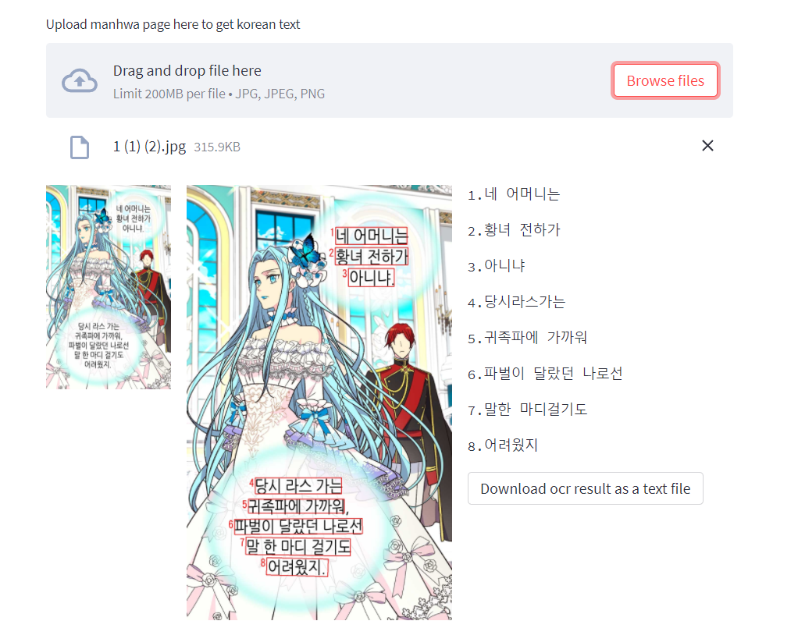
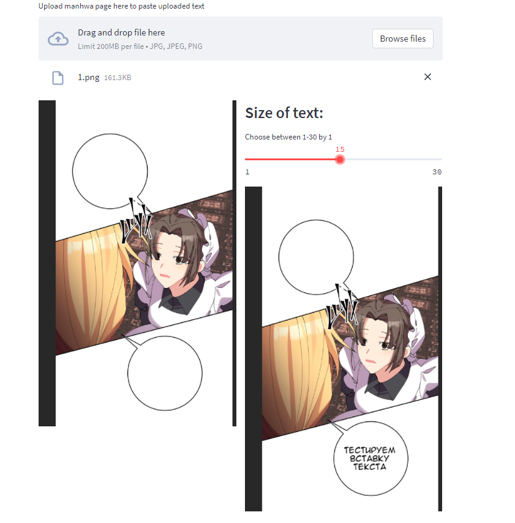

# Automatic Clean/Translation/Typing Manhwa Web Application
## Description
This Web Application can instantly translate Manhwa (korean comics) page from korean to russian.

This is my diploma project for bachelor degree in ITMO University

This Web App uses such CV (Computer Vision) technologies like:
* Object Detection (Mask RCNN) for detecting clouds with text
* Image Inpainting for removing text from cloud
* and, finally  OCR (Optical character recognition) for text detection and further translation

## Development
Currently, this web application can:
* detect text on Manhwa page and give possibility to download this text.
* Typing feature: you can select text and select size of it, and web application put your text in one of the detected clouds.

## UI
This application uses streamlit library which turns ML projects into shareable web apps in minutes and provides fancy design.

